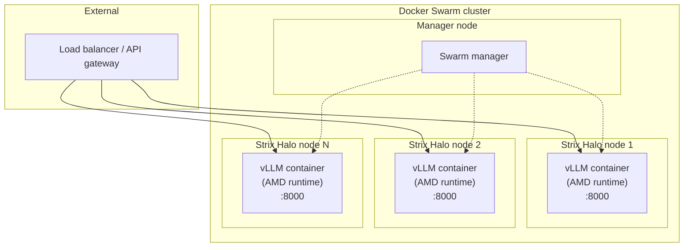

# Architecture: Multiple Strix Halo Nodes in Swarm

How to run an LLM API across **multiple AMD Strix Halo** machines using **Docker Swarm**: one Swarm cluster, GPU containers pinned to GPU nodes, and a single API surface.

---

## High-level schema

```
                    ┌─────────────────────────────────────────┐
                    │           Load balancer / Gateway        │
                    │         (e.g. Traefik, nginx, cloud)     │
                    └─────────────────────┬───────────────────┘
                                          │
                    ┌─────────────────────┼─────────────────────┐
                    │                     │                     │
                    ▼                     ▼                     ▼
         ┌──────────────────┐  ┌──────────────────┐  ┌──────────────────┐
         │  Swarm manager   │  │  Strix Halo #1   │  │  Strix Halo #2   │  ...
         │  (optional:      │  │  Worker node     │  │  Worker node     │
         │   also worker)   │  │  ┌────────────┐  │  │  ┌────────────┐  │
         │                  │  │  │ vLLM API   │  │  │  │ vLLM API   │  │
         │                  │  │  │ (container)│  │  │  │ (container)│  │
         │                  │  │  │ :8000      │  │  │  │ :8000      │  │
         │                  │  │  └────────────┘  │  │  └────────────┘  │
         │                  │  │  AMD GPU (ROCm)  │  │  AMD GPU (ROCm)  │
         └──────────────────┘  └──────────────────┘  └──────────────────┘
```

- **One Swarm cluster**: manager + N worker nodes; workers with AMD GPUs are the Strix Halo machines.
- **Services with placement**: vLLM (or any GPU service) is deployed with `node.hostname == <gpu-node>` so each task runs on a specific Strix Halo node.
- **Same image everywhere**: the custom vLLM image from this repo runs on each GPU node; see [IMAGE.md](IMAGE.md).
- **API**: Each node serves the vLLM API (e.g. port 8000). The load balancer in front distributes requests across nodes.

---

## Mermaid diagram



- **Manager** orchestrates services; **Strix Halo nodes** run one (or more) vLLM tasks with `AMD_VISIBLE_DEVICES=all` and the AMD container runtime.
- Setup of each GPU node (AMD container toolkit, `daemon.json`, restart) is in [SETUP.md](SETUP.md).

---

## Flow

1. **Join nodes to Swarm**: Install Docker + AMD container toolkit on each Strix Halo machine, configure `daemon.json` (see [SETUP.md](SETUP.md)), then `docker swarm join` from each worker to the manager.
2. **Deploy stack**: Define a service using this repo’s vLLM image, with `deploy.placement.constraints: node.hostname == <that-node>` (and optionally `replicas: 1` per GPU node).
3. **Expose ports**: Publish 8000 (or your chosen port) from each task; put a load balancer in front that routes to all nodes.
4. **Scale**: Add more Strix Halo nodes, join them to the Swarm, add more service replicas with placement, and register the new nodes in the load balancer.

For the exact `daemon.json` and a sample service YAML, see [SETUP.md](SETUP.md).
